# Celestaris

Website Portfolio

Three.js Portfolio Website Documentation
Project Overview
This portfolio website uses Three.js to showcase various software engineering and design projects. The website features interactive 3D elements, including a city model, dynamic overlays, and camera animations, providing a visually engaging user experience.

Features
Interactive 3D city with clickable UI panels

Smooth camera animations for transitions

Overlay panels for project details with a blurred background effect

Custom animations for 3D text banners

Responsive layout that adapts to different screen sizes

# Project Structure

### Dependencies

### Components

## ROOT.JSX

This file initializes and renders the `App` component into the DOM element with the id `root`, while logging a confirmation message. It imports necessary React and routing modules.

**Important Functions/Parameters:**

- **`createRoot()`**: Initializes a root React container for rendering components.
- **`document.getElementById("root")`**: Selects the DOM element with the id `root` where the app will be rendered.
- **`render(<App />)`**: Renders the `App` component into the selected DOM element.
- **`console.log("HAPPENED !!")`**: Logs a message indicating that the app has been rendered.

## CITY.JSX

This file renders a 3D city scene using Three.js in a React app, incorporating various interactive features like overlays, camera animations, and UI banners. It loads a city model (OBJ and MTL files), handles audio playback, and provides visual post-processing effects like bloom and depth of field.

### Important Functions/Parameters:

- **`CityModel({ onLoad })`**: Loads and displays a 3D city model using `OBJLoader` and `MTLLoader`, applying materials and scaling the model. It triggers the `onLoad` callback once the model is fully loaded.
- **`CameraLight`**: A spotlight follows the camera's position to simulate a dynamic light source in the scene. The light’s intensity, distance, and decay are adjustable.
- **`resetOrbit()`**: Resets the camera's orbit controls to the initial view after interacting with UI banners and re-enables the controls.
- **`toggleOverlay()`**: Toggles the visibility of overlays and simultaneously enables or disables the `OrbitControls` for user interaction.
- **`openOverlay(type)`**: Opens a specific overlay based on the provided content type (e.g., projects, poetry), setting the overlay’s content accordingly.
- **`startAudio()`**: Starts background audio (city ambiance) when the user first interacts with the scene.
- **`EffectComposer`**: Applies post-processing effects like `HueSaturation`, `BrightnessContrast`, `Bloom`, `DepthOfField`, and `Vignette` to the scene for enhanced visual aesthetics.

## UTILS.JSX

This file contains utility functions for commonly used operations in a Three.js React project, such as converting angles between degrees and radians.

### Important Functions/Parameters:

- **`degreesToRadians(degrees)`**: Converts an angle in degrees to its equivalent in radians. This function is essential for mathematical operations in 3D transformations.

## OVERLAYS.JSX

This file contains two components: `StartScreen` and `Overlay`. The `StartScreen` component displays an introductory screen with a fade-in effect, and the `Overlay` component renders a full-screen overlay with animated items, including a close button and an optional list of items.

### Important Functions/Parameters:

- **`StartScreen({ onStart, visible })`**: Displays an initial start screen with a button and hint text. The screen fades in based on the `visible` prop, and the `onStart` callback is triggered when the button is clicked.
- **`Overlay({ isActive, onClose, items = [] })`**: Renders a full-screen overlay with a list of items that animate into view. The visibility is controlled by the `isActive` prop, and `onClose` is triggered by the close button. Each item in the `items` array can contain a `title`, `website`, `siteLink`, and `abstract`.

## CAMERAANIMATIONS.JSX

This file defines two camera animation components for controlling the camera's movement and orientation in a 3D scene. They animate the camera's position and rotation smoothly towards target positions while optionally disabling controls during the animation.

### Important Functions/Parameters:

### `InitialCameraAnimation`

- **Props**:
  - `onComplete`: Callback function triggered when the camera finishes its movement to the target position.
- **Description**: This component animates the camera's movement to a target position and notifies the parent component once the animation is complete.

### `SmallTextCameraAnimation`

- **Props**:
  - `anchor`: Target position for the camera ([x, y, z]).
  - `lookat`: Target point for the camera to look at ([x, y, z]).
  - `onComplete`: Callback function triggered when the camera completes its movement and rotation.
  - `controlsRef`: A reference to the OrbitControls instance to disable controls during the animation.
- **Description**: This component animates the camera to a specific position and orientation while disabling the OrbitControls and notifying the parent component upon completion.

## TEXTS.JSX

This file defines two interactive 3D text banner components: `GlowingTextBanner` and `SmallTextBanner`. Both components provide animated and customizable text elements in a 3D space, with different interactivity features such as hover effects and expandable content.

### Important Functions/Parameters:

### `GlowingTextBanner`

- **Props**:
  - `text`: The text displayed on the banner.
  - `position`: The position of the banner in 3D space.
  - `rotation`: The rotation of the banner.
  - `onClick`: Callback function triggered on click.
- **Description**: Displays glowing text with a border that changes color on hover. The text is clickable and triggers the `onClick` function when clicked.

### `SmallTextBanner`

- **Props**:
  - `title`: The title text displayed on the banner.
  - `text`: The secondary text displayed on the banner.
  - `position`: The position of the banner in 3D space.
  - `rotation`: The rotation of the banner.
  - `width`: The width of the banner for text alignment.
  - `onClick`: Callback function triggered on click.
  - `isOpen`: Boolean to control if the banner is expanded.
  - `onOpen`: Callback function triggered when the banner is opened.
- **Description**: Displays an expandable 3D banner with title and content text. The banner expands when clicked and triggers animations.

Folder Structure

```mermaid
graph LR
classDef folderStyle fill:#f4f4f4,stroke:#000,stroke-width:2px,color:#000;
classDef fileStyle fill:#b6e0f5,stroke:#000,stroke-width:2px,color:#000;
classDef folderStylePublic fill:#d9e8e8,stroke:#000,stroke-width:2px,color:#000;
classDef fileStyleCSS fill:#f9d5d3,stroke:#000,stroke-width:2px,color:#000;
classDef fileStyleJS fill:#c7e4f2,stroke:#000,stroke-width:2px,color:#000;
classDef fileStyleFont fill:#f1e3f2,stroke:#000,stroke-width:2px,color:#000;
classDef fileStyleImage fill:#f2f4b3,stroke:#000,stroke-width:2px,color:#000;
classDef fileStyleJson fill:#d6e8c6,stroke:#000,stroke-width:2px,color:#000;




  node_0__["."]
  node_1_Landing_html["Landing.html"]
  node_2_README_md["README.md"]
  node_3_dependency_graph_png["dependency-graph.png"]
  node_4_dependency_graph3_dot["dependency-graph3.dot"]
  node_5_folder_structure_mmd["folder-structure.mmd"]
  node_6_folder_structure_txt["folder-structure.txt"]
  node_7_generalStyles_css["generalStyles.css"]
  node_8_index_html["index.html"]
  node_9_package_lock_json["package-lock.json"]
  node_10_package_json["package.json"]
  node_11_public["public"]
  node_12_City["City"]
  node_11_public --> node_12_City
  node_13_city_obj["city.obj"]
  node_12_City --> node_13_city_obj
  node_14_cityAMBIENCE_mp3["cityAMBIENCE.mp3"]
  node_12_City --> node_14_cityAMBIENCE_mp3
  node_15_cityMAT_mtl["cityMAT.mtl"]
  node_12_City --> node_15_cityMAT_mtl
  node_16_cityPAL_jpg["cityPAL.jpg"]
  node_12_City --> node_16_cityPAL_jpg
  node_17_cityTEX_zip["cityTEX.zip"]
  node_12_City --> node_17_cityTEX_zip
  node_18_Cursors["Cursors"]
  node_11_public --> node_18_Cursors
  node_19_arrowhead_hover_svg["arrowhead-hover.svg"]
  node_18_Cursors --> node_19_arrowhead_hover_svg
  node_20_arrowhead_mousedown_svg["arrowhead-mousedown.svg"]
  node_18_Cursors --> node_20_arrowhead_mousedown_svg
  node_21_arrowhead_normal_svg["arrowhead-normal.svg"]
  node_18_Cursors --> node_21_arrowhead_normal_svg
  node_22_close_normal_svg["close-normal.svg"]
  node_18_Cursors --> node_22_close_normal_svg
  node_23_close_purple_svg["close-purple.svg"]
  node_18_Cursors --> node_23_close_purple_svg
  node_24_lightning_normal_svg["lightning-normal.svg"]
  node_18_Cursors --> node_24_lightning_normal_svg
  node_25_lightning_purple_svg["lightning-purple.svg"]
  node_18_Cursors --> node_25_lightning_purple_svg
  node_26_move_normal_svg["move-normal.svg"]
  node_18_Cursors --> node_26_move_normal_svg
  node_27_move_purple_svg["move-purple.svg"]
  node_18_Cursors --> node_27_move_purple_svg
  node_28_Documents["Documents"]
  node_11_public --> node_28_Documents
  node_29_Amazon_s_Usability_pdf["Amazon's Usability .pdf"]
  node_28_Documents --> node_29_Amazon_s_Usability_pdf
  node_30_E_Business_Final_pdf["E-Business Final.pdf"]
  node_28_Documents --> node_30_E_Business_Final_pdf
  node_31_Poetry["Poetry"]
  node_28_Documents --> node_31_Poetry
  node_32_lux["lux"]
  node_31_Poetry --> node_32_lux
  node_33_section0["section0"]
  node_32_lux --> node_33_section0
  node_34_I_Musings_md["I - Musings.md"]
  node_33_section0 --> node_34_I_Musings_md
  node_35_II_Mirrors_md["II - Mirrors.md"]
  node_33_section0 --> node_35_II_Mirrors_md
  node_36_III_Ex_Nihilo_md["III- Ex Nihilo.md"]
  node_33_section0 --> node_36_III_Ex_Nihilo_md
  node_37_IV_The_Black_md["IV - The Black.md"]
  node_33_section0 --> node_37_IV_The_Black_md
  node_38_IX_Florence_md["IX - Florence.md"]
  node_33_section0 --> node_38_IX_Florence_md
  node_39_V_Infinitum_md["V - Infinitum.md"]
  node_33_section0 --> node_39_V_Infinitum_md
  node_40_VI_Polar_md["VI - Polar.md"]
  node_33_section0 --> node_40_VI_Polar_md
  node_41_VII_Fleeting_md["VII - Fleeting.md"]
  node_33_section0 --> node_41_VII_Fleeting_md
  node_42_VIII_Coin_md["VIII - Coin.md"]
  node_33_section0 --> node_42_VIII_Coin_md
  node_43_section1["section1"]
  node_32_lux --> node_43_section1
  node_44_I_Rasa_md["I - Rasa.md"]
  node_43_section1 --> node_44_I_Rasa_md
  node_45_II_Nouveau_md["II - Nouveau.md"]
  node_43_section1 --> node_45_II_Nouveau_md
  node_46_III_Ceive_md["III - 'Ceive.md"]
  node_43_section1 --> node_46_III_Ceive_md
  node_47_IV_Unholy_md["IV - Unholy.md"]
  node_43_section1 --> node_47_IV_Unholy_md
  node_48_V_Aside_I_md["V - Aside I.md"]
  node_43_section1 --> node_48_V_Aside_I_md
  node_49_VI_Aside_II_md["VI - Aside II.md"]
  node_43_section1 --> node_49_VI_Aside_II_md
  node_50_VII_Essence_Relativity_md["VII - Essence Relativity.md"]
  node_43_section1 --> node_50_VII_Essence_Relativity_md
  node_51_uber_pdf["uber.pdf"]
  node_28_Documents --> node_51_uber_pdf
  node_52_Files["Files"]
  node_11_public --> node_52_Files
  node_53_arrows["arrows"]
  node_52_Files --> node_53_arrows
  node_54_leftArrow_png["leftArrow.png"]
  node_53_arrows --> node_54_leftArrow_png
  node_55_rightArrow_png["rightArrow.png"]
  node_53_arrows --> node_55_rightArrow_png
  node_56_bia["bia"]
  node_52_Files --> node_56_bia
  node_57_amazon["amazon"]
  node_56_bia --> node_57_amazon
  node_58_amazon_glb["amazon.glb"]
  node_56_bia --> node_58_amazon_glb
  node_59_nike["nike"]
  node_56_bia --> node_59_nike
  node_60_1_dSQNoDS35yKndSXJKcAdKw_webp["1_dSQNoDS35yKndSXJKcAdKw.webp"]
  node_59_nike --> node_60_1_dSQNoDS35yKndSXJKcAdKw_webp
  node_61_2063_webp["2063.webp"]
  node_59_nike --> node_61_2063_webp
  node_62_FFLkbsNXEAIexKu_jpg["FFLkbsNXEAIexKu.jpg"]
  node_59_nike --> node_62_FFLkbsNXEAIexKu_jpg
  node_63_Nike_E_Business_V2_docx["Nike E-Business V2.docx"]
  node_59_nike --> node_63_Nike_E_Business_V2_docx
  node_64_Nike_0_png["Nike_0.png"]
  node_59_nike --> node_64_Nike_0_png
  node_65_Nike_1_png["Nike_1.png"]
  node_59_nike --> node_65_Nike_1_png
  node_66_Nike_10_png["Nike_10.png"]
  node_59_nike --> node_66_Nike_10_png
  node_67_Nike_11_png["Nike_11.png"]
  node_59_nike --> node_67_Nike_11_png
  node_68_Nike_12_png["Nike_12.png"]
  node_59_nike --> node_68_Nike_12_png
  node_69_Nike_13_png["Nike_13.png"]
  node_59_nike --> node_69_Nike_13_png
  node_70_Nike_14_pdf["Nike_14.pdf"]
  node_59_nike --> node_70_Nike_14_pdf
  node_71_Nike_15_png["Nike_15.png"]
  node_59_nike --> node_71_Nike_15_png
  node_72_Nike_16_png["Nike_16.png"]
  node_59_nike --> node_72_Nike_16_png
  node_73_Nike_17_png["Nike_17.png"]
  node_59_nike --> node_73_Nike_17_png
  node_74_Nike_18_png["Nike_18.png"]
  node_59_nike --> node_74_Nike_18_png
  node_75_Nike_2_png["Nike_2.png"]
  node_59_nike --> node_75_Nike_2_png
  node_76_Nike_3_png["Nike_3.png"]
  node_59_nike --> node_76_Nike_3_png
  node_77_Nike_3_2_png["Nike_3_2.png"]
  node_59_nike --> node_77_Nike_3_2_png
  node_78_Nike_4_png["Nike_4.png"]
  node_59_nike --> node_78_Nike_4_png
  node_79_Nike_5_pdf["Nike_5.pdf"]
  node_59_nike --> node_79_Nike_5_pdf
  node_80_Nike_6_png["Nike_6.png"]
  node_59_nike --> node_80_Nike_6_png
  node_81_Nike_7_png["Nike_7.png"]
  node_59_nike --> node_81_Nike_7_png
  node_82_Nike_8_png["Nike_8.png"]
  node_59_nike --> node_82_Nike_8_png
  node_83_Nike_9_png["Nike_9.png"]
  node_59_nike --> node_83_Nike_9_png
  node_84_The_brand_analysis_of_Nike_based_on_its_emotional__pdf["The_brand_analysis_of_Nike_based_on_its_emotional_.pdf"]
  node_59_nike --> node_84_The_brand_analysis_of_Nike_based_on_its_emotional__pdf
  node_85_Untitled_Diagram_drawio["Untitled Diagram.drawio"]
  node_59_nike --> node_85_Untitled_Diagram_drawio
  node_86_d5c72cb18497d1ea65f29f0857a8c760_png["d5c72cb18497d1ea65f29f0857a8c760.png"]
  node_59_nike --> node_86_d5c72cb18497d1ea65f29f0857a8c760_png
  node_87_e0fa6c7f1acede72686fc96f5b532a4db2_pharrell_williams_1x_rsquare_w1400_webp["e0fa6c7f1acede72686fc96f5b532a4db2-pharrell-williams.1x.rsquare.w1400.webp"]
  node_59_nike --> node_87_e0fa6c7f1acede72686fc96f5b532a4db2_pharrell_williams_1x_rsquare_w1400_webp
  node_88_lebron_james_dec_6_2022_jpg["lebron-james-dec-6-2022.jpg"]
  node_59_nike --> node_88_lebron_james_dec_6_2022_jpg
  node_89_map_drawio["map.drawio"]
  node_59_nike --> node_89_map_drawio
  node_90_nike_glb["nike.glb"]
  node_56_bia --> node_90_nike_glb
  node_91_uber_glb["uber.glb"]
  node_56_bia --> node_91_uber_glb
  node_92_landing["landing"]
  node_52_Files --> node_92_landing
  node_93_briefcase_glb["briefcase.glb"]
  node_92_landing --> node_93_briefcase_glb
  node_94_cap_glb["cap.glb"]
  node_92_landing --> node_94_cap_glb
  node_95_controller_glb["controller.glb"]
  node_92_landing --> node_95_controller_glb
  node_96_miscellaneous_glb["miscellaneous.glb"]
  node_92_landing --> node_96_miscellaneous_glb
  node_97_misc["misc"]
  node_52_Files --> node_97_misc
  node_98_books_glb["books.glb"]
  node_97_misc --> node_98_books_glb
  node_99_headphones_glb["headphones.glb"]
  node_97_misc --> node_99_headphones_glb
  node_100_mic_glb["mic.glb"]
  node_97_misc --> node_100_mic_glb
  node_101_speaker_glb["speaker.glb"]
  node_97_misc --> node_101_speaker_glb
  node_102_vinyl_glb["vinyl.glb"]
  node_97_misc --> node_102_vinyl_glb
  node_103_uber["uber"]
  node_52_Files --> node_103_uber
  node_104_iphone_glb["iphone.glb"]
  node_103_uber --> node_104_iphone_glb
  node_105_phone_glb["phone.glb"]
  node_103_uber --> node_105_phone_glb
  node_106_Fonts["Fonts"]
  node_11_public --> node_106_Fonts
  node_107_Lena["Lena"]
  node_106_Fonts --> node_107_Lena
  node_108_Lena_ttf["Lena.ttf"]
  node_107_Lena --> node_108_Lena_ttf
  node_109_Orbitron["Orbitron"]
  node_106_Fonts --> node_109_Orbitron
  node_110_Orbitron_Black_ttf["Orbitron-Black.ttf"]
  node_109_Orbitron --> node_110_Orbitron_Black_ttf
  node_111_Orbitron_Bold_ttf["Orbitron-Bold.ttf"]
  node_109_Orbitron --> node_111_Orbitron_Bold_ttf
  node_112_Orbitron_ExtraBold_ttf["Orbitron-ExtraBold.ttf"]
  node_109_Orbitron --> node_112_Orbitron_ExtraBold_ttf
  node_113_Orbitron_Medium_ttf["Orbitron-Medium.ttf"]
  node_109_Orbitron --> node_113_Orbitron_Medium_ttf
  node_114_Orbitron_Regular_ttf["Orbitron-Regular.ttf"]
  node_109_Orbitron --> node_114_Orbitron_Regular_ttf
  node_115_Orbitron_SemiBold_ttf["Orbitron-SemiBold.ttf"]
  node_109_Orbitron --> node_115_Orbitron_SemiBold_ttf
  node_116_Icon_JPG["Icon.JPG"]
  node_11_public --> node_116_Icon_JPG
  node_117_JavaScript["JavaScript"]
  node_11_public --> node_117_JavaScript
  node_118_jquery_js["jquery.js"]
  node_117_JavaScript --> node_118_jquery_js
  node_119_shared_js["shared.js"]
  node_117_JavaScript --> node_119_shared_js
  node_120_Lena_Regular_json["Lena_Regular.json"]
  node_11_public --> node_120_Lena_Regular_json
  node_121_Pages["Pages"]
  node_11_public --> node_121_Pages
  node_122_BIA["BIA"]
  node_121_Pages --> node_122_BIA
  node_123_amazon["amazon"]
  node_122_BIA --> node_123_amazon
  node_124_amazon_css["amazon.css"]
  node_123_amazon --> node_124_amazon_css
  node_125_amazon_html["amazon.html"]
  node_123_amazon --> node_125_amazon_html
  node_126_amazon_js["amazon.js"]
  node_123_amazon --> node_126_amazon_js
  node_127_nike["nike"]
  node_122_BIA --> node_127_nike
  node_128_nike_css["nike.css"]
  node_127_nike --> node_128_nike_css
  node_129_nike_html["nike.html"]
  node_127_nike --> node_129_nike_html
  node_130_nike_js["nike.js"]
  node_127_nike --> node_130_nike_js
  node_131_shared_css["shared.css"]
  node_122_BIA --> node_131_shared_css
  node_132_uber["uber"]
  node_122_BIA --> node_132_uber
  node_133_uber_css["uber.css"]
  node_132_uber --> node_133_uber_css
  node_134_uber_html["uber.html"]
  node_132_uber --> node_134_uber_html
  node_135_uber_js["uber.js"]
  node_132_uber --> node_135_uber_js
  node_136_Poetry["Poetry"]
  node_121_Pages --> node_136_Poetry
  node_137_Lux["Lux"]
  node_136_Poetry --> node_137_Lux
  node_138_section0["section0"]
  node_137_Lux --> node_138_section0
  node_139_section0_html["section0.html"]
  node_138_section0 --> node_139_section0_html
  node_140_section0_js["section0.js"]
  node_138_section0 --> node_140_section0_js
  node_141_section1["section1"]
  node_137_Lux --> node_141_section1
  node_142_section1_html["section1.html"]
  node_141_section1 --> node_142_section1_html
  node_143_section1_js["section1.js"]
  node_141_section1 --> node_143_section1_js
  node_144_favicon["favicon"]
  node_11_public --> node_144_favicon
  node_145_apple_touch_icon_png["apple-touch-icon.png"]
  node_144_favicon --> node_145_apple_touch_icon_png
  node_146_favicon_96x96_png["favicon-96x96.png"]
  node_144_favicon --> node_146_favicon_96x96_png
  node_147_favicon_ico["favicon.ico"]
  node_144_favicon --> node_147_favicon_ico
  node_148_favicon_svg["favicon.svg"]
  node_144_favicon --> node_148_favicon_svg
  node_149_site_webmanifest["site.webmanifest"]
  node_144_favicon --> node_149_site_webmanifest
  node_150_web_app_manifest_192x192_png["web-app-manifest-192x192.png"]
  node_144_favicon --> node_150_web_app_manifest_192x192_png
  node_151_web_app_manifest_512x512_png["web-app-manifest-512x512.png"]
  node_144_favicon --> node_151_web_app_manifest_512x512_png
  node_152_fonts_css["fonts.css"]
  node_11_public --> node_152_fonts_css
  node_153_generalStyles_css["generalStyles.css"]
  node_11_public --> node_153_generalStyles_css
  node_154_styling_css["styling.css"]
  node_11_public --> node_154_styling_css
  node_155_root_css["root.css"]
  node_156_root_html["root.html"]
  node_157_root_jsx["root.jsx"]
  node_158_src["src"]
  node_159_Components["Components"]
  node_158_src --> node_159_Components
  node_160_cameraAnimations_jsx["cameraAnimations.jsx"]
  node_159_Components --> node_160_cameraAnimations_jsx
  node_161_overlays_jsx["overlays.jsx"]
  node_159_Components --> node_161_overlays_jsx
  node_162_texts_jsx["texts.jsx"]
  node_159_Components --> node_162_texts_jsx
  node_163_Data["Data"]
  node_158_src --> node_163_Data
  node_164_Business_Intelligence_Analytics_json["Business Intelligence & Analytics.json"]
  node_163_Data --> node_164_Business_Intelligence_Analytics_json
  node_165_Dissertation_json["Dissertation.json"]
  node_163_Data --> node_165_Dissertation_json
  node_166_Game_Design_Development_json["Game Design & Development.json"]
  node_163_Data --> node_166_Game_Design_Development_json
  node_167_Miscellaneous_json["Miscellaneous.json"]
  node_163_Data --> node_167_Miscellaneous_json
  node_168_Poetry_json["Poetry.json"]
  node_163_Data --> node_168_Poetry_json
  node_169_landing_json["landing.json"]
  node_163_Data --> node_169_landing_json
  node_170_city_jsx["city.jsx"]
  node_158_src --> node_170_city_jsx
  node_171_root_jsx["root.jsx"]
  node_158_src --> node_171_root_jsx
  node_172_utils_jsx["utils.jsx"]
  node_158_src --> node_172_utils_jsx
  node_173_tree_to_mermaid_js["tree-to-mermaid.js"]
  node_174_vite_config_js["vite.config.js"]
  node_176_34_directories_141_files["34 directories, 141 files"]
```

How It Works
3D City Model
The website renders a 3D city model using Three.js. The user can interact with the model using the mouse, and each part of the city links to a different project or content section.

UI Panels and Interactions
The UI panels slide in from the left and right when triggered by clicking on the 3D text banners.

The background is blurred to focus attention on the overlay content.

The user can close the overlay, returning to the main city view.

Camera Animations
When the page loads, an initial camera animation positions the viewer in front of the city.

Smaller animations trigger when interacting with specific text banners, smoothly guiding the user through different sections of the website.

Future Improvements
Implement dynamic loading of 3D models to optimize performance.

Add more interactivity with animated 3D objects or characters.

Optimize for mobile and tablet responsiveness.

Add a backend for project content management and dynamic portfolio updates.

Conclusion
This Three.js portfolio website integrates interactive 3D graphics with React to create an engaging and visually appealing user experience. It highlights various software engineering and design projects with dynamic animations, overlays, and smooth camera transitions.
