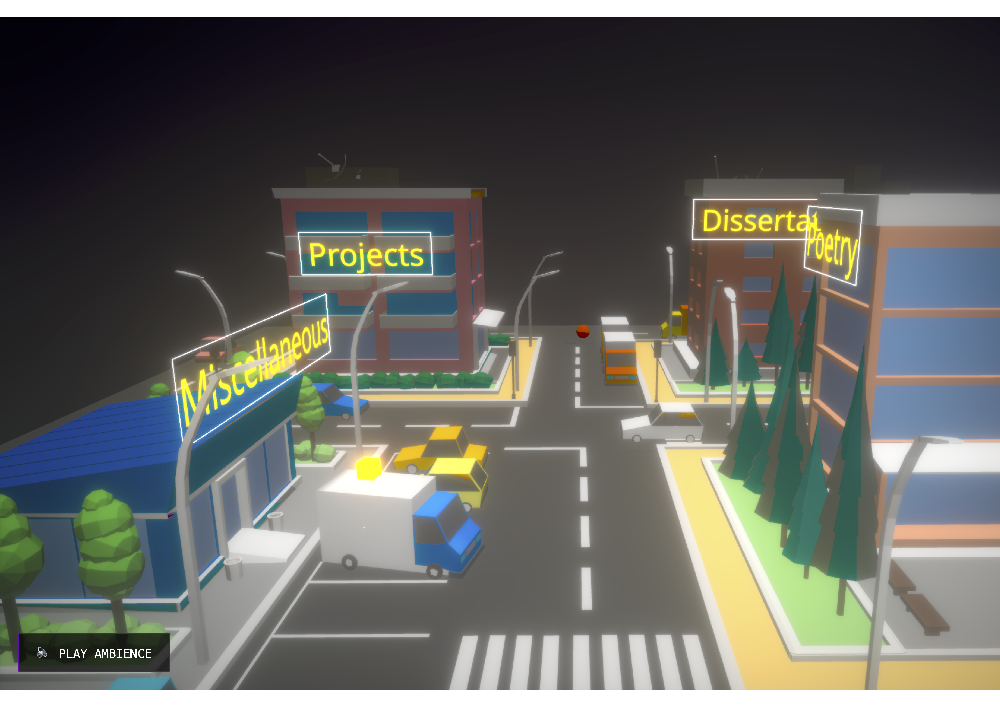
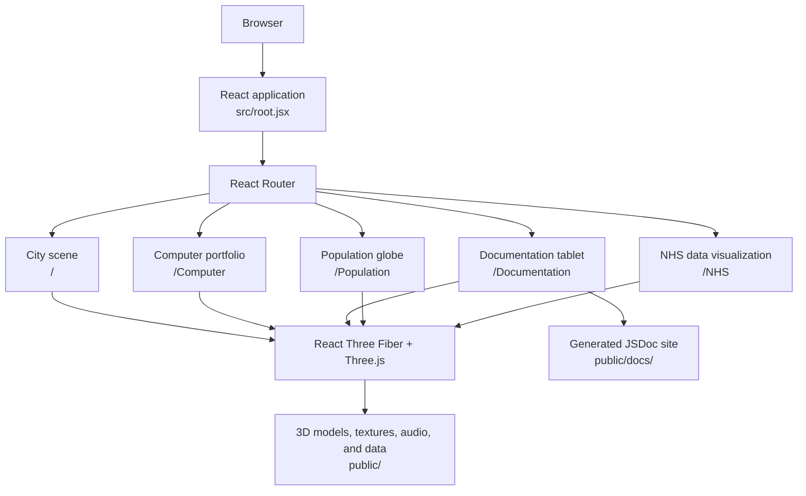

<div align="center">
   <h1>Celestaris</h1>
   <p>An interactive 3D portfolio for exploring projects, data stories, and technical work.</p>
   <p>
      <a href="https://react.dev/"></a>
      <a href="https://threejs.org/"></a>
      <a href="https://vite.dev/"></a>
      <a href="https://tailwindcss.com/"></a>
   </p>
   <p>
      <a href="https://bolajiadewal3.github.io/Celestaris/"></a>
      <a href="https://bolajiadewal3.github.io/Celestaris/"></a>
      
   </p>
</div>

## Overview

Celestaris is a browser-based portfolio and interactive showcase built with React and Three.js. Instead of presenting every project in a conventional grid, it connects portfolio content to immersive 3D environments: visitors can explore a stylized city, interact with scene controls, and open project and information panels.

The experience also includes focused scenes for a 3D computer portfolio, technical documentation, a population globe, and an NHS data-visualization case study. Responsive interactions, camera transitions, ambient audio, and visual effects help make each section feel like part of one cohesive experience.



## Key Features

- **Explorable 3D city:** Navigate the main scene and discover projects and other portfolio content through interactive 3D banners and overlays.
- **Immersive portfolio view:** Explore a 3D computer with portfolio content presented on its screen.
- **Data-led scenes:** View population information on an interactive globe and explore NHS-related geographic data visualization.
- **Technical documentation:** Browse generated project documentation within a dedicated 3D tablet scene.
- **Scene interactions:** Use camera animations, orbit controls, hover feedback, and contextual overlays to move through the experience.
- **Environmental details:** The city scene includes weather and environment controls, rain and wet-road effects, ambient audio, and achievement feedback.
- **Web-based delivery:** Runs in modern browsers and is configured for deployment to GitHub Pages.

## Architecture


```mermaid
flowchart TD
   Browser[Browser] --> App[React application<br/>src/root.jsx]
   App --> Router[React Router]

   Router --> City[City scene<br/>/]
   Router --> Portfolio[Computer portfolio<br/>/Computer]
   Router --> Docs[Documentation tablet<br/>/Documentation]
   Router --> Population[Population globe<br/>/Population]
   Router --> NHS[NHS data visualization<br/>/NHS]

   City --> Renderer[React Three Fiber + Three.js]
   Portfolio --> Renderer
   Docs --> Renderer
   Population --> Renderer
   NHS --> Renderer

   Renderer --> Assets[3D models, textures, audio, and data<br/>public/]
   Docs --> GeneratedDocs[Generated JSDoc site<br/>public/docs/]
```

## Tech Stack

| Area | Technologies |
| --- | --- |
| UI and routing | React 19, React DOM, React Router |
| 3D rendering | Three.js, React Three Fiber, Drei, `r3f-globe` |
| Animation and effects | React Spring, React Three Postprocessing |
| Data visualization | D3, GeoJSON |
| Styling | Tailwind CSS 4, custom CSS |
| Build and development | Vite 7, `@vitejs/plugin-react`, `@tailwindcss/vite` |
| Documentation | JSDoc, Better Docs, Docdash |
| Deployment | `gh-pages`; Vite base path is `/Celestaris/` |

## Getting Started

### Prerequisites

- Node.js and npm
- Git

### Install and run

1. Clone the repository and enter the project directory:

   ```bash
   git clone https://github.com/bolajiadewal3/Celestaris.git
   cd Celestaris
   ```

2. Install dependencies:

   ```bash
   npm install
   ```

3. Start the Vite development server:

   ```bash
   npm run dev
   ```

4. Open the local URL printed by Vite. The project config uses port `3000` by default.

To create a production build, run `npm run build`. The output is written to `dist/`.

## Scripts Reference

| Command | Description |
| --- | --- |
| `npm run dev` | Start the Vite development server. |
| `npm run build` | Generate JSDoc, copy documentation into the public assets, and build the production site. |
| `npm run serve` | Preview the production build locally using Vite Preview. Run `npm run build` first. |
| `npm run docs` | Generate and patch the JSDoc site. |
| `npm run movedocs` | Copy generated documentation into `public/docs`. |
| `npm run deploy` | Publish the `dist/` directory with `gh-pages`. |
| `npm test` | Placeholder only; no automated test suite is configured yet. |

ESLint is included and configured, but this repository does not currently define an npm lint script. To run it directly, use `npx eslint .`.

## License and Acknowledgments

The package metadata declares the project license as **ISC**. See `package.json` for the current declaration.

Celestaris is built with the React, Three.js, React Three Fiber, Drei, React Spring, D3, and Vite communities' open-source work. It also uses project-specific 3D models, textures, audio, and portfolio materials stored in `public/`.
